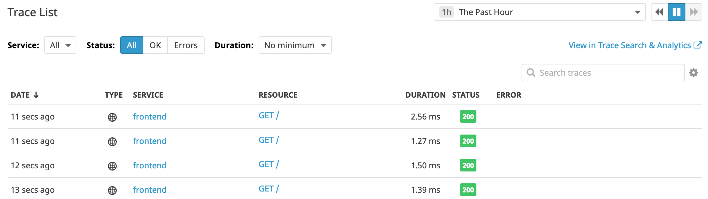
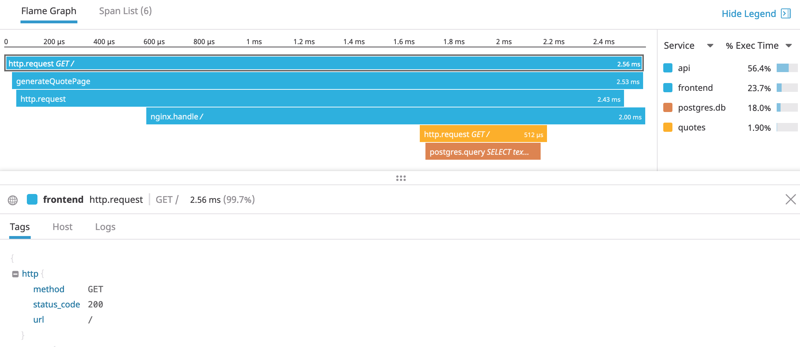

# Distributed Tracing Example for APM

This example demonstrates distributed tracing from a front-end application to a backend application and database via a proxy that represents an API gateway.

# Run using docker-compose

A simple way to build and run these applications is using `docker-compose`.

```bash
export DD_API_KEY="..." # enter your unique key here
docker-compose build
docker-compose up -d
```

Example output:
```sh-session
$ docker-compose up -d
Starting api-gateway_quotes-db_1     ... done
Starting api-gateway_datadog-agent_1 ... done
Recreating api-gateway_quotes_1      ... done
Recreating api-gateway_api_1         ... done
Recreating api-gateway_frontend_1    ... done
$ 
```

Once the applications have launched, a request can be sent using your web browser to http://localhost:8999/ or using command-line tools such as `wget` or `curl`.

```sh-session
$ curl http://localhost:8999/
<!doctype html>
<html lang="en">
  <head>
    <meta charset="utf-8">
    <title>Random Programming Quote</title>
  </head>
  <body>
    <blockquote>The more technology you learn, the more you realize how little you know.</blockquote>
  </body>
</html>
$ wget -q -O- http://localhost:8999/
<!doctype html>
<html lang="en">
  <head>
    <meta charset="utf-8">
    <title>Random Programming Quote</title>
  </head>
  <body>
    <blockquote>A/B Test twice, deploy changes once.</blockquote>
  </body>
</html>
$
```




# Experimenting

The code and configuration provided are minimal to demonstrate distributed tracing, and can be useful for experiments.
After making modifications, the containers should be rebuilt and restarted.

```bash
docker-compose kill
docker-compose build
docker-compose up -d
```

# Cleanup

To clean up things created by `docker-compose`, run the following command:
```bash
docker-compose down
```

Example output:
```sh-session
$ docker-compose down
Stopping api-gateway_frontend_1      ... done
Stopping api-gateway_api_1           ... done
Stopping api-gateway_quotes_1        ... done
Stopping api-gateway_datadog-agent_1 ... done
Stopping api-gateway_quotes-db_1     ... done
Removing api-gateway_frontend_1      ... done
Removing api-gateway_api_1           ... done
Removing api-gateway_quotes_1        ... done
Removing api-gateway_datadog-agent_1 ... done
Removing api-gateway_quotes-db_1     ... done
Removing network api-gateway_default
$
```
