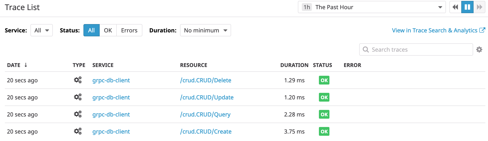
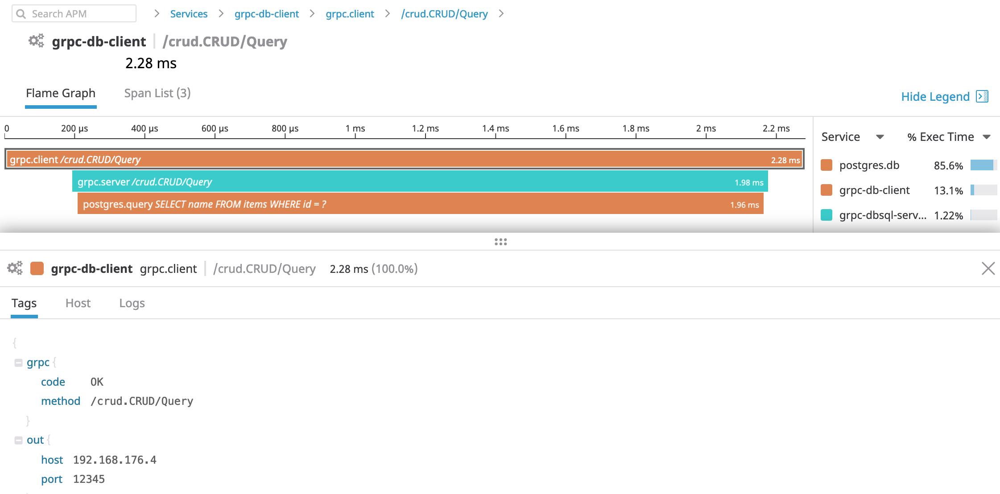

# Datadog APM for GRPC and Databases

This example demonstrates adding Datadog tracing to GRPC clients, servers and database interactions.
It contains:
- A simple protobuf definition for a "CRUD" service
- A GRPC client that interacts using the "CRUD" service
- A GRPC server that stores data in postgresql using standard `database/sql` methods
- A GRPC server that stores data in postgresql using [gorm](https://gorm.io/)

# Run using docker-compose

A simple way to build and run these applications is using `docker-compose`.

```bash
export DD_API_KEY="..." # enter your unique key here
docker-compose build
docker-compose up -d
docker-compose logs grpc-db-client
```

Example output

```sh-session
$ docker-compose logs grpc-db-client
Attaching to grpc-db_grpc-db-client_1
grpc-db-client_1     | 2019/09/09 18:04:46 created, id = 1
grpc-db-client_1     | 2019/09/09 18:04:46 queried. found = true name = foo
grpc-db-client_1     | 2019/09/09 18:04:46 updated = true
grpc-db-client_1     | 2019/09/09 18:04:46 deleted = true
```





# Run locally

These can be built and run locally:
```bash
go get github.com/DataDog/trace-examples/go/grpc/grpc-db/...
```

This will create the three applications:

- grpc-db-client
- grpc-dbsql-server
- grpc-gorm-server

To run these, a postgres database and datadog agent instance will be required.


