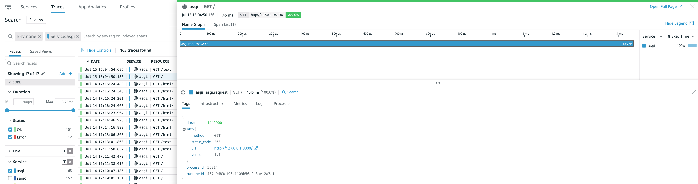

# [ASGI](https://asgi.readthedocs.io/en/latest/) [(startlette)](https://www.starlette.io/) Example App

This is an example ASGI starlette app to send traces as well as test manual instrumentation of ddtrace ASGI integration.

## Code Requirements

- <a href="https://docs.datadoghq.com/agent/basic_agent_usage/?tab=agentv6v7">datadog-agent</a>, 
- <a href="https://docs.datadoghq.com/tracing/setup/python/">datadog-tracing-library</a> & 
- <a href="https://www.starlette.io/">starlette</a>
- ASGI server e.g: <a href="http://www.uvicorn.org/">uvicorn</a>

The best way to get started is to clone this repo and run:

### Execution:

If you already have datadog agent running as well as ASGI server: ```uvicorn```, you could run: ```uvicorn app:app```.

Then open your browser to http://127.0.0.1:8000

### Implementations:

- Basic request and response traces would look like:

