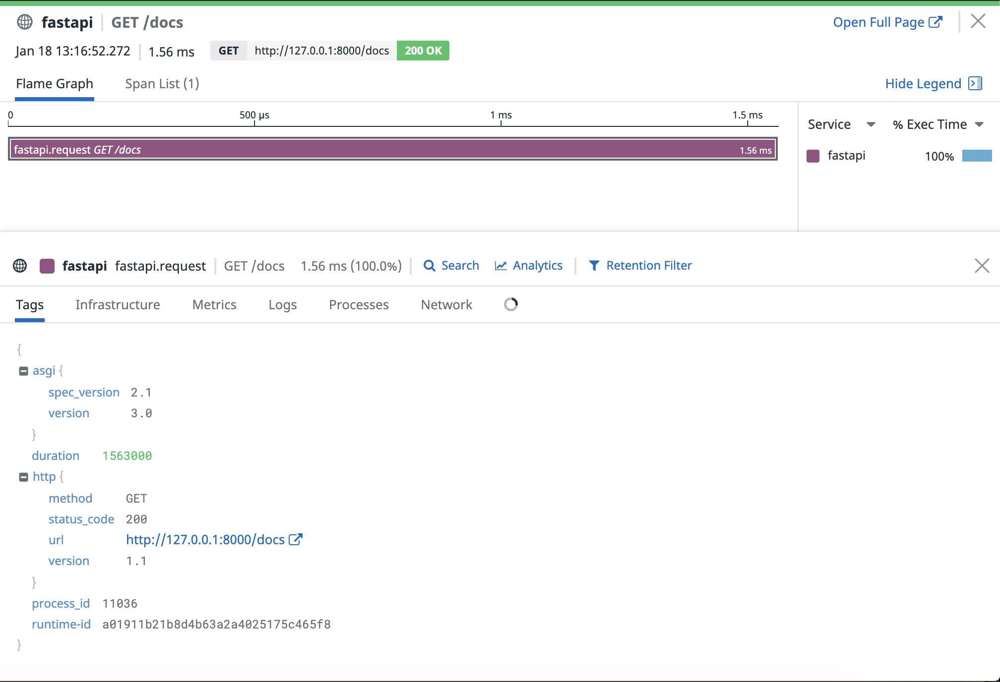
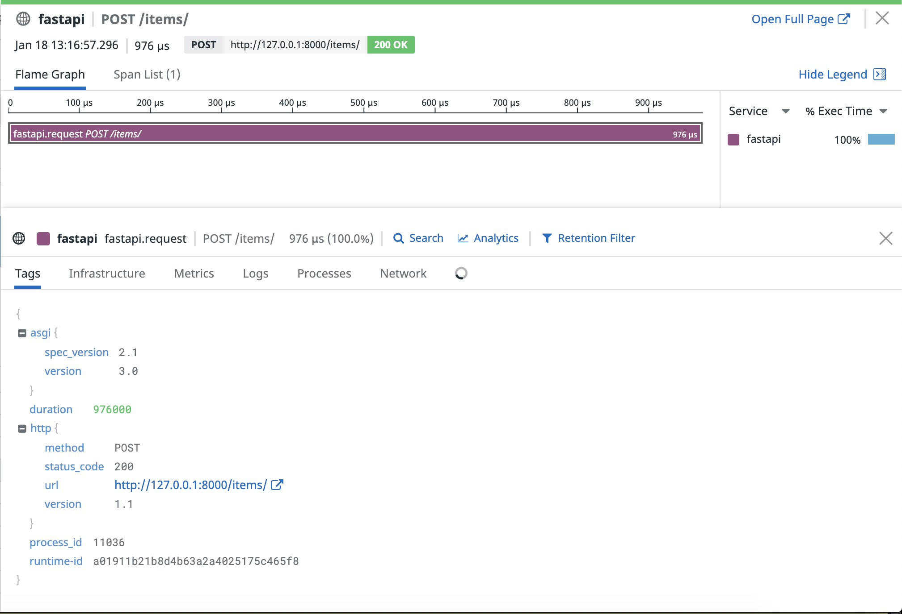

# [FastAPI](https://fastapi.tiangolo.com/) Example App

This is an example FastAPI app to instrument the application as well as for testing purposes.

## Code Requirements

- <a href="https://docs.datadoghq.com/agent/basic_agent_usage/?tab=agentv6v7">datadog-agent</a> 
- <a href="https://docs.datadoghq.com/tracing/setup/python/">datadog-tracing-library</a> 
- <a href="https://www.uvicorn.org/"> uvicorn </a>
- <a href="https://fastapi.tiangolo.com/">fastapi</a>

The best way to get started is to clone this repo and run:

## Execution:

If you already have datadog agent running, you could run: ```ddtrace-run uvicorn app:app```.

Then open your browser to http://127.0.0.1:8000/docs

## Implementations:

- Basic request and response traces would look like:




