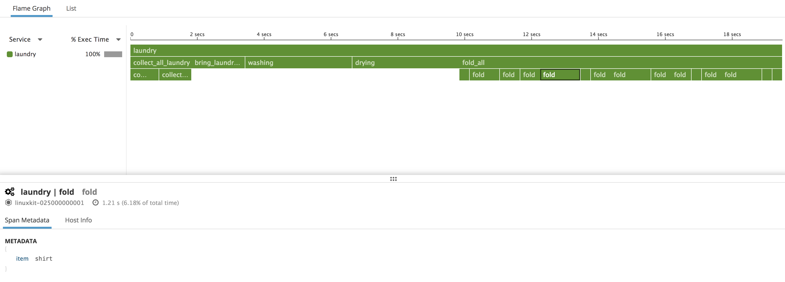

# OpenTracing/laundry example

A simple example of how you could trace an application with Datadog's OpenTracer
implementation.

## Install/Setup

Please refer to the README in the directory above.


## Running

Simply run:

```sh
$ python laundry.py
```

## Explanation

This example provides a simple example of how to use Datadog's opentracer to
trace your applications with Datadog.

It is very silly but hopefully sheds some light on how tracing works and how you
can trace with our OpenTracing-compatible tracer.

Hopefully the code is easy enough to read through, but the gist of it is that we
are folding laundry.

We first have to collect the laundry, then we have to bring it to the washing
machine. Then we wash, dry and fold the laundry.

There are variable numbers and types of items that we collect to wash.


### What it should look like

You should get something similar to following output:

```
collecting laundry:
  from bedroom
  from washroom
  from floor
bringing laundry to washer
washing
drying
folding:
  socks
  towel
  socks
  towel
  pants
  shirt
  socks
  towel
  shirt
  towel
  towel
  socks
  pants
  shirt
  socks
  socks
done!
```

and on your Datadog traces page you should see a new trace that looks similar to
the following:


