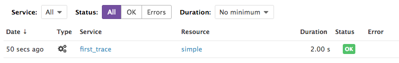
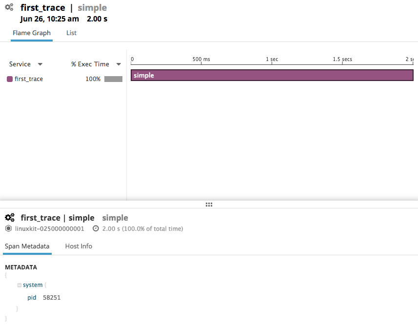

# OpenTracing/walkthrough

Here we walk through usage of the various OpenTracing features and how they
integrate with the Datadog platform.

## Install/Setup

Please refer to the README in the directory above.


## 1) First trace

Tracing your OpenTracing-compatible application with the Datadog opentracer is
extremely easy!

Take a look at [1_first_trace.py](1_first_trace.py). This application simply
traces an operation we call 'simple' which just makes a call to `time.sleep()`.
So we should expect our resulting trace to be a single span of length about 2
seconds.

Let's run this very simple application and get the trace showing up in Datadog.
To do this we can run the following command:

```sh
$ python 1_first_trace.py
```

We set `DATADOG_SERVICE_NAME` manually here so we know what to look for in the
Datadog trace dashboard.

`ddopentrace-run` installs the Datadog tracer and runs the application. After
this finishes executing wait a little bit for the trace to be sent to the agent
and then to the Datadog backend.

The trace should appear in the Datadog dashboard:



Clicking on this trace will reveal more information about it:



If you've gotten here without issue: congratulations on sending your first trace!

Feel free now to go ahead and play around with this first example, changing the
service name or the name of the trace.
