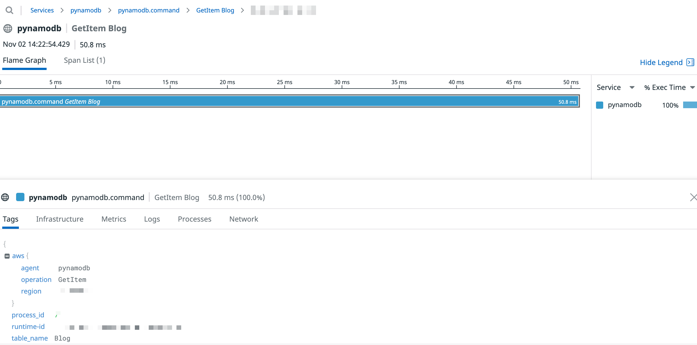

### PynamoDB Example Script

Based on the PynamoDB tutorial [here](https://pynamodb.readthedocs.io/en/latest/tutorial.html), with the boto configuration example based on [here](https://boto.readthedocs.io/en/latest/boto_config_tut.html). When it spins up, a simple python script that makes various PynamoDB calls runs. This also assumes that you have Docker running, because it uses the [DynamoDB Local Docker Image](https://hub.docker.com/r/amazon/dynamodb-local). Note that this sample app is for **testing/dev** purposes on a local instance of DynamoDB.

For additional Python APM configuration options, refer to the API docs [here](http://pypi.datadoghq.com/trace/docs/integrations.html#pynamodb).

#### Setup

**Step 1)** Set up a `.env` file (`./.env`) in this directory. Inside the file, add:

```
AWS_ACCESS_KEY_ID=<EXAMPLE KEY>
AWS_SECRET_ACCESS_KEY=<EXAMPLE KEY>
DD_API_KEY=<DATADOG API KEY>
```

Note: Since this is a local test database instance, you can leave it as `<EXAMPLE KEY>` and this will send traces to Datadog as long as the `<DATADOG API KEY>` is provided.

**Step 2)** Then launch your Docker containers, inspired by the [testing here](https://github.com/DataDog/dd-trace-py#testing):

```
docker-compose up -d

docker-compose run --rm pynamodb-script
```

**Step 3)** Now that you're in the `pynamodb-script` container, you can run the `index.py` script with any of these commands:

- Standalone: `python3 index.py`
- With Datadog Python APM tracer ([configuration options](https://docs.datadoghq.com/tracing/setup/python/#environment-variable) apply): `ddtrace-run python3 index.py`

**Step 4)** When you're done, you can spin down the containers with:

```
docker-compose down
```

#### Resources

1. https://pynamodb.readthedocs.io/en/latest/tutorial.html
2. https://boto.readthedocs.io/en/latest/boto_config_tut.html
3. https://github.com/DataDog/dd-trace-py
4. https://docs.datadoghq.com/tracing/setup/python/
5. https://hub.docker.com/r/amazon/dynamodb-local
6. http://pypi.datadoghq.com/trace/docs/integrations.html#pynamodb

#### Example Trace


