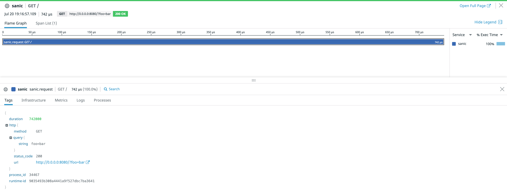
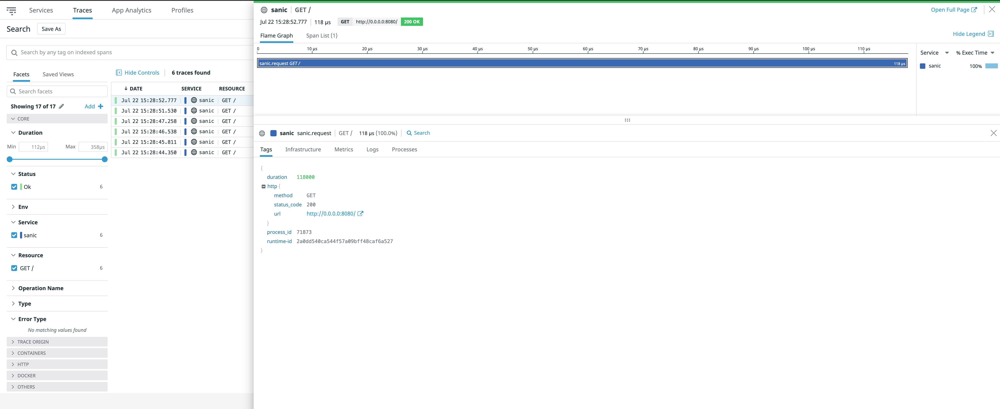

# [Sanic](https://sanic.readthedocs.io/en/latest/index.html) Example App

This is an example sanic app to instrument the application as well as for testing purposes.

## Code Requirements

- <a href="https://docs.datadoghq.com/agent/basic_agent_usage/?tab=agentv6v7">datadog-agent</a>, 
- <a href="https://docs.datadoghq.com/tracing/setup/python/">datadog-tracing-library</a> & 
- <a href="https://sanic.readthedocs.io/en/latest/index.html">sanic</a>

The best way to get started is to clone this repo and run:

### Execution Option 1:

If you already have datadog agent running, you could run: ```ddtrace-run python basic_app.py```.

### Execution Option 2:

Note: before running ```docker-compose```, update the ```env_file``` (e.g: ```.bashrc```, ```.bash_profile```) which contains ```Datadog API key``` or specify API key as environment variable.

```
docker-compose build --no-cache
docker-compose up
```

Then open your browser to http://0.0.0.0:<your_port>/

### Implementations:

- Basic request and response traces would look like:




